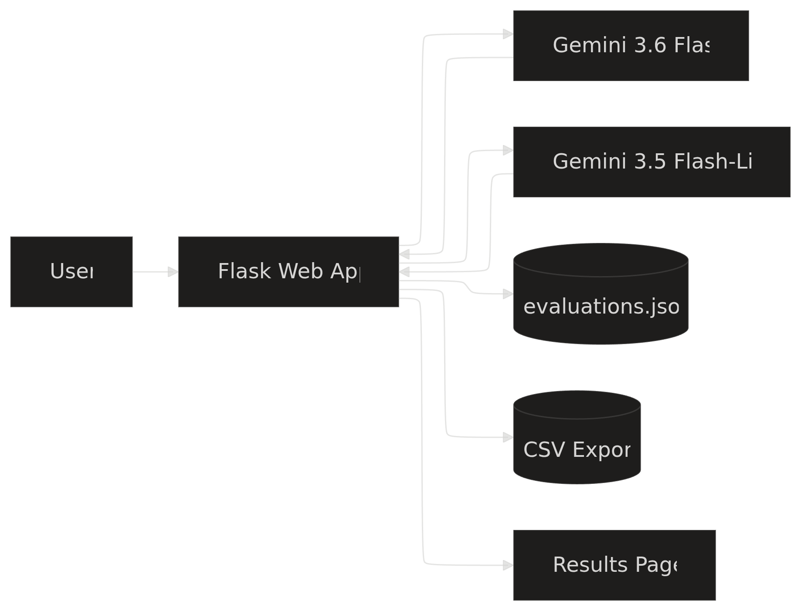

# AI Response Evaluation Dashboard

A Flask web app for **comparing two Gemini models on the same prompt** using a structured evaluation rubric and a model-as-judge.  
It’s designed to showcase skills in LLM evaluation, QA, and practical full‑stack development.

> Example:
> ``

---

## Demo

- Live demo: `<!-- Add deployment URL here, e.g. https://your-app.onrender.com -->`
- Demo video: `<!-- Add Loom / YouTube link here, e.g. https://youtu.be/xxxx -->`

> TIP: Once you record a short (30–90s) screen recording, link it here so recruiters can see the app in action without running it.

---

## What this app does

- Takes **one prompt** from the user.
- Sends it to **two Gemini models** (e.g., Gemini 3.6 Flash vs Gemini 3.5 Flash‑Lite).
- Shows both responses side by side.
- Lets you **score each response** with a 5‑dimension rubric.
- Uses a **judge model** (Gemini) to auto‑score each response in JSON.
- Saves all evaluations in JSON.
- Shows:
  - Per‑model average scores.
  - Prompt type distribution.
  - **Human vs judge average** comparison.
- Exports all evaluations to **CSV** for further analysis.

---

## Screenshots

- Prompt and responses (input + side‑by‑side answers)  
  ``

- Evaluation form (human scoring for both models)  
  ``

- Results page (averages, human vs judge comparison)  
  ``

---

## Architecture

The app is intentionally simple and easy to follow.



---

## Evaluation rubric

Each response is scored from **1 to 5** (1 = poor, 5 = excellent) on:

1. **Factual accuracy**  
   How correct and reliable the response is.

2. **Instruction following**  
   How well the response follows the prompt’s instructions and format.

3. **Completeness**  
   How fully the response answers all parts of the question.

4. **Clarity and structure**  
   How easy the response is to read and understand.

5. **Safety and appropriateness**  
   Whether the response is safe, respectful, and appropriate for the user.

The full rubric with score anchors lives in:  
`evaluation_rubric.md`

---

## Tech stack

- Python
- Flask
- HTML + CSS (no heavy frontend framework)
- JSON file storage (`evaluations.json`)
- CSV export
- Gemini API via the `google-genai` SDK

---

## Models used

- **Gemini 3.6 Flash** – main fast, capable model (Model A).
- **Gemini 3.5 Flash‑Lite** – lighter / baseline model (Model B).
- **Judge model** – uses Gemini (same family) to assign rubric scores in JSON.

You can change the exact model IDs in `models_api.py` if Google updates names or you want to compare other variants.

---

## Project structure

```text
ai-response-eval-dashboard/

├── docs/
│   └── images/            # Project images
├── app.py                 # Flask app: routes, saving, stats, CSV export
├── models_api.py          # Gemini model calls + judge logic
├── evaluations.json       # Stored evaluations (created at runtime)
├── evaluation_rubric.md   # Human-readable rubric
├── TEST_PROMPTS.md        # Golden set of test prompts
├── FINAL_CHECKLIST.md     # Final testing / audit checklist
├── requirements.txt
├── templates/
│   ├── index.html         # Prompt input + side-by-side responses + forms
│   └── results.html       # Stats, comparison tables, full history
├── static/
│   └── style.css          # Basic styling
└── README.md
```

> TIP: If you add screenshots, you can also create `docs/images/` for them and show the structure here.

---

## Setup

### 1. Clone the repo

```bash
git clone https://github.com/YOUR_USERNAME/ai-response-eval-dashboard.git
cd ai-response-eval-dashboard
```

### 2. Install dependencies

```bash
pip install -r requirements.txt
```

If needed:

```bash
pip install google-genai flask
```

### 3. Set your Gemini API key

From Google AI Studio, create an API key and set it as an environment variable:

```bash
export GOOGLE_API_KEY="your_api_key_here"
```

(On Windows, add `GOOGLE_API_KEY` to your user environment variables.)

---

## Running the app

Start the Flask server:

```bash
python app.py
```

Open the app in your browser:

```text
http://127.0.0.1:5000
```

---

## How to use the dashboard

1. **Enter a prompt** on the main page.
2. Click **“Generate Both Responses”**.
3. Review the side‑by‑side outputs from both models.
4. Select a **prompt type** (e.g., reasoning, summarization, coding).
5. Score each response on the five rubric dimensions.
6. (Automatically) the **judge model** scores each response in the background.
7. Click **“Save evaluation”**.
8. Go to **“View all evaluations”** to see:
   - Model averages.
   - Prompt type distribution.
   - Human vs judge average comparison.
   - Full table of evaluations.
9. Click **“Download CSV”** to export data for further analysis.

---

## Test prompts

A small “golden set” of prompts is in:

- `TEST_PROMPTS.md`

They cover:

- Summarization  
- Technical support  
- Instruction following  
- Coding  
- Reasoning  
- Safety  
- Translation  
- JSON formatting  
- Practical planning

You can use these to quickly populate the dashboard and create nice screenshots.

---

## Implementation notes

- **`models_api.py`**  
  - `get_model_response(prompt, model_name)` calls the selected Gemini model.  
  - `judge_response(prompt, response_text)` calls a judge model and asks it to return JSON scores with the rubric dimensions.

- **`app.py`**  
  - `/` route: prompt input, dual model responses, human scoring forms, save logic.  
  - `/results` route: statistics, human vs judge comparison.  
  - `/export_csv` route: generates a CSV from all evaluations.

- **Storage**  
  - All evaluations are appended to `evaluations.json`.  
  - A normalization function handles old/new schema changes safely.

---

## What this project demonstrates

- Designing and implementing a **rubric‑based LLM evaluation** system.
- Using **multiple AI models** in one workflow (two candidates + judge).
- Building a small but complete **Flask web app**.
- Working with **structured outputs** from Gemini (`application/json`).  
- Saving and analyzing evaluation data (JSON + CSV).

This is meant as a practical, portfolio‑ready example of how to evaluate AI models, not just use them.

---

## Ideas for future improvements

- Add filters to the results page (by prompt type, score range, model).
- Add charts (e.g., score distributions, per‑model radar charts).
- Add authentication if deployed publicly.
- Try alternative judge models or ensembles.
- Deploy the app and link the live URL here.

---

## Author

Yann Da Silva Melo  
[GitHub](https://github.com/Nydoehar) · [LinkedIn](https://linkedin.com/in/yann-silva-melo/)

> TIP: Once you have screenshots and a demo, update the “Demo” and “Screenshots” sections. Those are the first things recruiters will look at when they open the repo.
